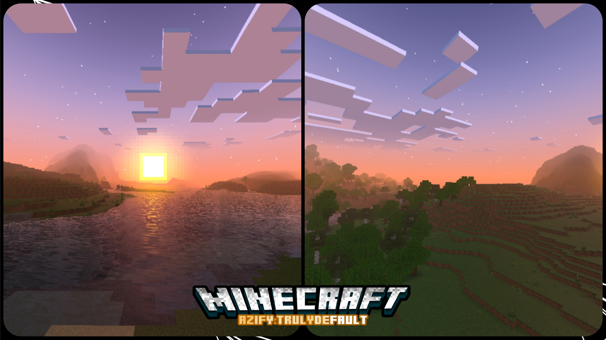
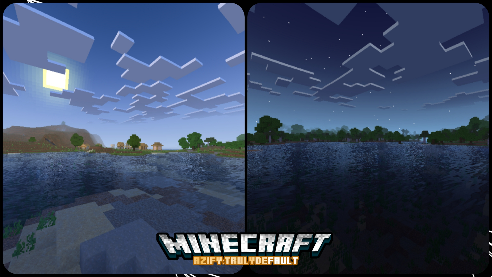
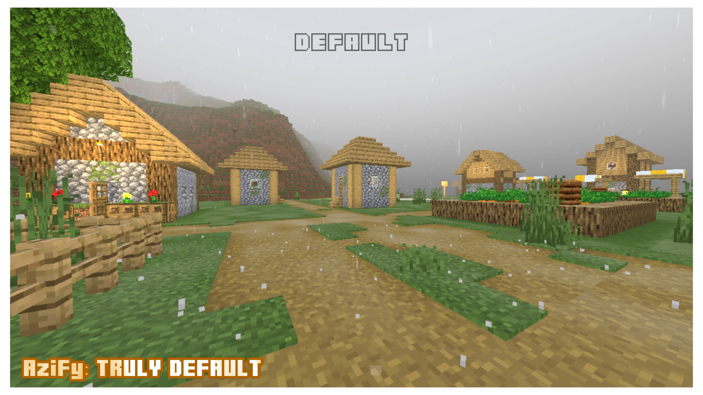
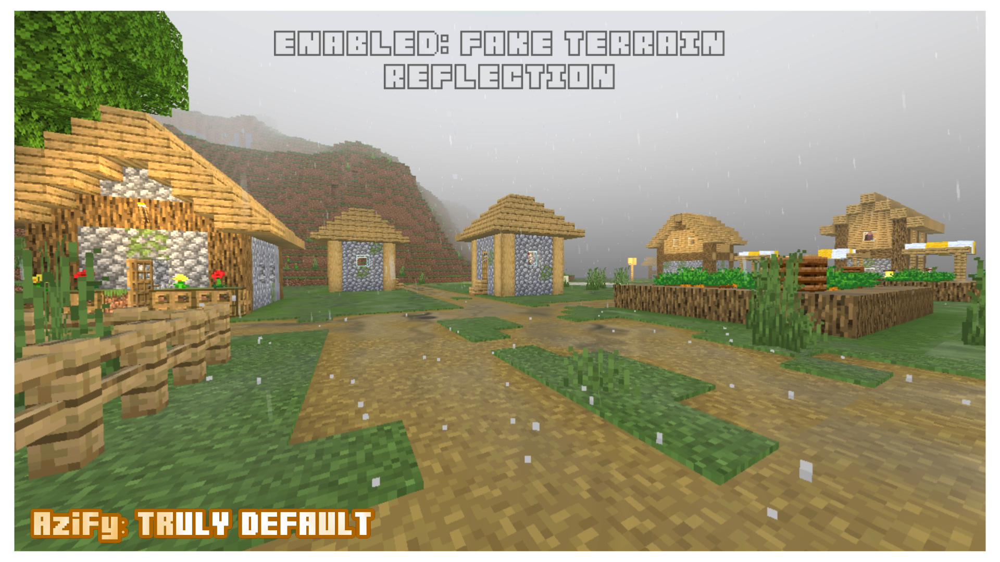
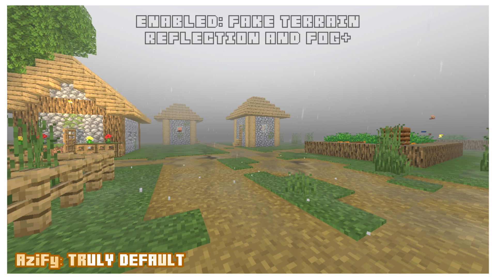

# AziFy: Truly Default
The **AziFy Truly Default Shader** enhances the classic vanilla look of Minecraft while focusing on being lightweight and delivering ultra-realistic visuals.

**Supported Platforms**: Android, iOS, and Windows

> **Warning**
> This is an experimental repository.





## Features Turned Off by Default




## Installation

> **Note**
> Shaders are not officially supported on Minecraft Bedrock. The following are unofficial ways to load shaders.

### Linux
1. Extract `material.bin` files from the shader MCPACK or build materials manually.
2. Move these files to the data root `mcpelauncher/versions/1.20.x/assets/renderer/materials/` (make sure to backup all files in this folder first).
3. Import the resource pack and activate it in global resources.

### Windows
1. Use [BetterRenderDragon](https://github.com/ddf8196/BetterRenderDragon) to enable MaterialBinLoader.
2. Import the resource pack and activate it in global resources.

### Android
1. Install the [Patched Minecraft App](https://devendrn.github.io/renderdragon-shaders/shaders/installation/android#using-patch-app).
2. Import the resource pack and activate it in global resources.

## How To Customize?

> **Experimental Customization**

### Android

**Requirements:**
- Download Termux.
- Download MT Manager.

#### Step 1:
- Open Termux and run:
  ```sh
  pkg install openjdk-17 git
  ```
- Clone this repository:
  ```sh
  git clone https://github.com/Aziangelo/<REPONAME>.git
  ```
- Set up the build environment:
  ```sh
  ./setup.sh
  ```
- Navigate to the cloned repository:
  ```sh
  cd <REPONAME>
  ```

#### Step 2:
- Open MT Manager.
- Click the menu, then click the `3 dots (...)`.
- Click `Add local storage`.
- Find Termux and click on it, then select `use this folder`.

#### Step 3:
- Open the Termux folder and navigate to `<REPONAME>/include/azify`.
- Open `shader_inputs.glsl`.
- Edit and customize the shader as desired.

#### Step 4:
- After finishing your customizations, build the shader using:
  ```sh
  ./build.sh
  ```
- To build only the terrain for Android and Windows, run:
  ```sh
  ./build.sh -m RenderChunk
  ```

### Build Script Parameters
| Option | Description |
| :-: | :- |
| -p | Target platforms (Android, Windows, iOS, Merged) |
| -m | Materials to compile (if unspecified, builds all material files) |
| -t | Number of threads to use for compilation (default is CPU core count) |

Compiled `material.bin` files will be located in `build/<platform>/`.

## Download/Releases
- [v3.0 Android/iOS](https://github.com/Aziangelo/AF-TrulyDefault/releases/tag/v3.0.1)

