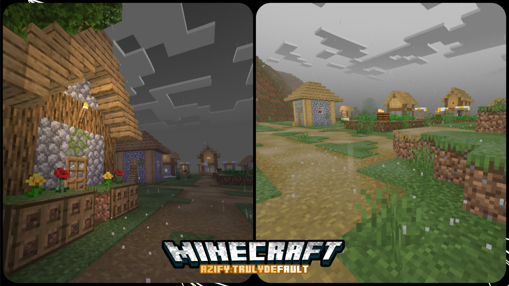

# AziFy: Truly Default
The AziFy Truly Default Shader, enhances the classic vanilla look of Minecraft. It tries to focus on being lightweight while delivering ultra-realistic visuals.

**Supports Android, iOS, and Windows**
> [!Warning]
> This is an experimental repository.




&nbsp;
&nbsp;
### Turn Off by Default Features


&nbsp;
## Installation

> [!NOTE]
> Shaders are not officially supported on Minecraft Bedrock. The following are unofficial ways to load shaders.

**Linux:** [mcpelauncher-manifest](https://github.com/minecraft-linux/mcpelauncher-ui-manifest)
1. Extract material.bin files from shader mcpack / build materials manually
2. Move these files to data root `mcpelauncher/versions/1.20.x/assets/renderer/materials/`. (Make sure to backup all files in this folder first)
3. Import the resource pack and activate it in global resources.

**Windows:**
1. Use [BetterRenderDragon](https://github.com/ddf8196/BetterRenderDragon) to enable MaterialBinLoader.
2. Import the resource pack and activate it in global resources.

**Android:**
1. Install [Patched Minecraft App](https://devendrn.github.io/renderdragon-shaders/shaders/installation/android#using-patch-app)
2. Import the resource pack and activate it in global resources.

&nbsp;
## How To Customize?
> This is an **Experimental Customization**

### Android:

Requirements:
- Download Termux.
- Download MT manager.

**STEP 1:**
- Open Termux and run `pkg install openjdk-17 git`
- Get the clone of this repository: `https://github.com/Aziangelo/<REPONAME>.git`
- Setup build environment: `./setup.sh`
- run `cd <REPONAME>`

**STEP 2:**
- Open MT manager.
- Click the menu and then click the `3dots (...)`
- Click `Add local storage`
- Find termux and click on it then click `use this folder`

**STEP 3:**
- Now Open termux folder and open the file`<REPONAME>/include/azify`
- Open `shader_inputs.glsl`
- Now you can edit there and customize however you want.

**STEP 4:**
- After FINISHED.
- build the shader using `./build.sh`
- if you wanted to build only terrain for Android and Windows run
```./build.sh -m RenderChunk```
If you want to compile RenderChunk.bin

&nbsp;

**Available parameters for the build script:**
| Option | Parameter description |
| :-: | :- |
| -p | Target platforms (Android, Windows, iOS, Merged) |
| -m | Materials to compile (if unspecified, builds all material files) |
| -t | Number of threads to use for compilation (default is CPU core count) |

Compiled material.bin files will be inside `build/<platform>/`


## Download/Releases
- [v3.0 Android/iOS](https://github.com/Aziangelo/AF-TrulyDefault/releases/tag/v3.0.1)
